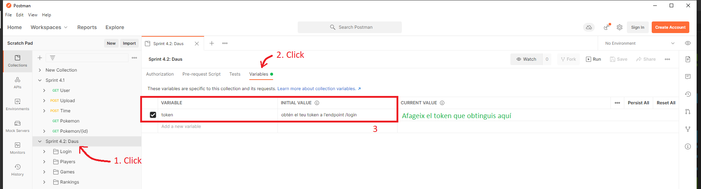

# Sprint 4.2

API que dona suport a un joc de daus. Tires dos daus de 6 cares. Si la suma és igual a 7 guanyes, si no, perds.

## Requeriments

Per a poder provar l'API cal tenir els següents programes instal·lats.

- NodeJS (https://nodejs.org/ca/)

I mínim un d'aquests dos sistemes de bases de dades.

- Servidor MySQL (https://www.mysql.com/)
- MongoDB (https://www.mongodb.com)

## Instal·lació

### Descarrega el repositori

Descarrega't aquesta branca (Sprint4_2) al teu ordinador local. Si tens GIT instal·lat, fes-ho amb la següent ordre:

`git clone -b sprint4_2 https://github.com/oriolsastre/nodeInitialDemo --single-branch`

### Configura les variables d'entorn

A la carpeta que t'acabes de descarregar anomenada 'nodeInitialDemo' hi trobaràs un fitxer que es diu ".env-template". Fes-ne una còpia, anomena aquesta còpia ".env" i comepleta els camps de l'interior amb els paràmetres del teu equip. Sobretot configura les credèncials del servidors MySQL o MongoDB que estigui corrent al teu ordinador.

També pots configurar la contrassenya de l'administrador de l'API, que per defecte serà 1234 si no la modifiques. Aquesta contrassenya és important per poder accedir als endpoints de l'API.

No canviïs el EXPRESS_PORT del 3000 si no és absolutament necessari. Si ho fas, tingues en compte que la col·lecció de Postman que trobaràs adjunta assumeix que l'API està corrent al Port 3000.

### Instal·lar dependències

Ara ja pots instal·lar les dependències necessàries per a l'API executant al terminal l'ordre:

`npm install`

I ja pots iniciar el servidor. Si vols iniciar-lo usant MySQL utilitza l'ordre:

`npm run mysql`

Si el vols iniciar usant MongoDB, aleshores caldrà fer-ho amb l'ordre:

`npm run mongo`

## API

Al punt d'entrada (per defecte: localhost:3000) tens una descripció dels endpoints i mètodes disponibles.

### Primers passos
Ja que per accedir als endpoints necessites un token, cal que la primera acció sigui aconseguir aquest token.

Per accedir-lo cal fer una petició POST a l'endpoint `/login`, afegint una Autenticació Bàsica a la capçalera del request amb l'usuari: "Admin" i la contrassenya: "1234" (o la que hagis determinat a les variables d'entorn).

El token que obtinguis és el que hauràs d'adjuntar a la capçalera de les peticions que facis a tots els altres endpoints.

A més a més, si crees un jugador a l'endpoint `/players` definint usuari, contrassenya i un paràmetre `level: 0`, aquest usuari també es podrà autenticar a l'enpoint `/login` per obtenir el seu propi token.

## POSTMAN

Per facilitar les comprovacions dels enpoints amb postman, s'ha adjuntat una col·lecció en aquesta mateixa carpeta. Cal que en iniciar postman, obtinguis el teu token tal i com s'ha descrit anteriorment a l'apartat _Primers passos_. Desa aquest token a una variable anomenada {{token}}, d'aquesta manera els altres endpoints ja usaran el token desat en aquesta variable en les seves peticions.

De no ser així, caldrà, en cada petició, activar l'autorització, triant l'opció "Token bearer" i proporcionant el token obtingut.

