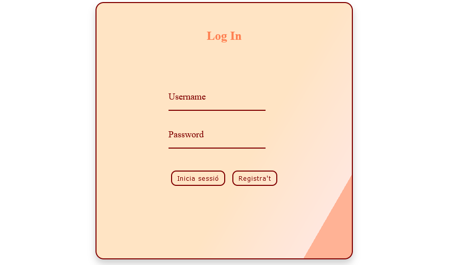
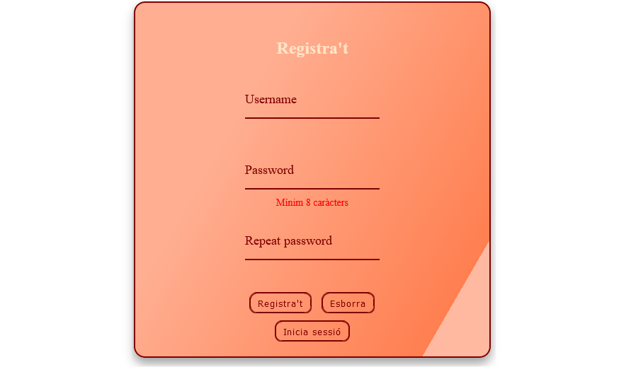
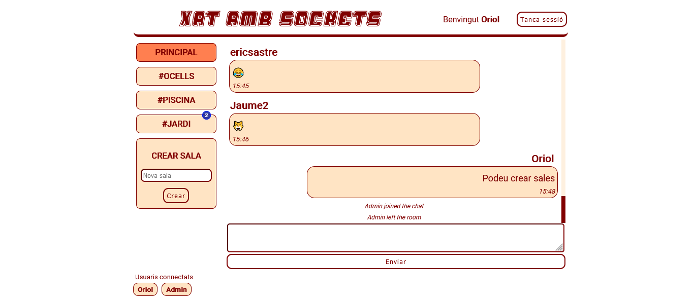

# FRONTEND

Servidor client per a una aplicació de xat usant socket.io. Fet amb HTML i CSS, aixecant el servidor amb el framework `express` de `NodeJS`.

## Tecnologia usada

## Login

<small>Formulari d'inici de sessió.</small>

<small>Formulari de registre.</small>

Pàgina d'entrada al xat on l'usuari es pot registrar o pot crear un compte nou.

Per a crear-se un compte s'ha de tenir en compte:

- __Usuari__: Només pot contenir caràcters alfanumèrics amb un màxim de 20 caràcters.
- __Contrassenya__: Ha de contenir un mínim de 8 caràcters, i ha de contenir mínim una lletra (a-zA-Z) i mínim un número (0-9).

El formulari d'inscripció comprova que aquestes característiques es compleixen i també avisa si el nom d'usuari està disponible, ja que ha de ser únic, no hi poden haver dos usuaris amb el mateix nom en el xat (independentment de les majúsucles/minúscules).

## Xat

Al xat només s'hi pot accedir tenint un token valid, que es reb del backend fent una petició correcta l'endpoint POST /login. La connexió de sockets també requereix del token. Aquest token és desat al _local storage_ del navegador.

Si no hi ha token o el token és invàlid es redirigeix a la pàgina _Login_ sense carregar cap informació del xat.

Al xat hi ha dues seccions, les sales i els missatges.

### Sales

Es poden crear sales però els noms han de ser __únics__ amb un __màxim de 11 caràcters__. Els espais en blanc són eliminats del nom de les sales del xat.

Per entrar a la sala cal fer click sobre el nom de la sala, i aleshores els missatges s'enviaran només a aquella sala.

Durant la sessió, si es reben missatges a una sala diferent a la que s'està en aquell moment, apareix una notificació en globus sobre la sala en qüestió, per a poder idetificar quines sales estan més actives.

### Missatges

Els missatges són "escapats" (tractats) al seu pas cap al backend per evitar atacs.

Als missatges se'ls elimina els espais en blancs a l'inici i no es poden enviar missatges buits. No hi ha limitació de llargada definida. Es poden enviar emojis també.

Al xat també apareixen avisos dels següents esdeveniments:

- Quan un usuari es connecta al xat.
- Quan un usuari es desconnecta del xat.
- Quan un usuari s'unexi a la sala on estem.
- Quan un usuari abandona la sala on estem.

Al _footer_ del xat podem veure quins usuaris estan connectats en aquell moment.

Al _header_ del xat l'usuari pot tancar la sessió i es netejarà el _local storage_ i serà redirigit a la pàgina de _login_.

Vista general del xat. A l'esquerra veiem les sales existents, el formulari de creació de sales, la sala on estem remarcada en taronja i una notificació globus advertint-nos que s'han enviat dos missatges nous a la sala #JARDI.

Al centre veiem els missatges. Els propis a la dreta i els altres a l'esquerra. Es poden enviar també emojis. Apareixen també els avisos que l'usuari _Admin_ s'ha unit al xat però que després ha abandonat la sala, presumptament per unir-se a la sala #JARDI on hi ha enviat un parell de missatges.

A baix veiem que ara mateix hi ha 2 usuaris connectats.